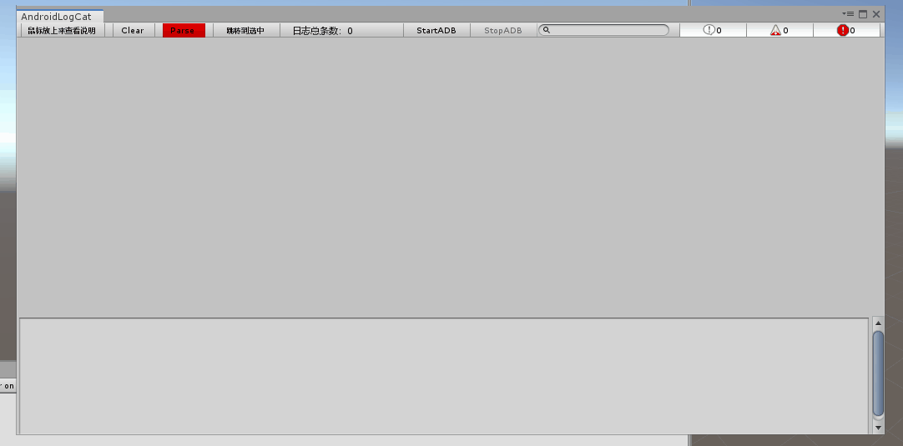

# Unity下安卓日志工具
---

---
## 支持的模式
- 1.将已有杂乱日志分离为消息和堆栈，可视化增强.
> 目前匹配的日志格式有以下：
>> `06-20 15:32:52.662  4555  4654 I Unity   : 日志内容xxx` 
>> `06-20 15:32:52.662: I/Unity(15673):  日志内容xxx ` 

> 操作步骤：从其他地方复制日志到系统剪贴板，点击Parse按钮，等待数秒后就会格式好所有的日志. 
>> 这里的其他地方指的是 Android Device Monitor中的LogCat里面全选复制 或者是 cmd下的adb logcat命令返回的日志.如果需要新增识别不同格式，只需要往sRegexs字段新增自定义的正则即可. 
- 2.支持adb连接实时打印日志.
> usb连上手机，开启调试模式，然后点击StartADB按钮即可.
---
## 使用技巧
- 支持上下箭头切换上一个或者下一个日志，Home键切换到日志开头，End键切换到日志最后.
- 支持搜索指定关键字（不区分大小写），然后选择某条日志后，点输入框的×来定位到刚刚选中的日志.
- 跳转到选中：置顶当前选中的日志.
---
## 目前已知问题
- 启动ADB后，无法正常关闭ADB，需要手动关闭ADB.
- Unity2017.3.0f2以下版本存在部分中文乱码，建议用Unity2017.3.0f2及以上版本
